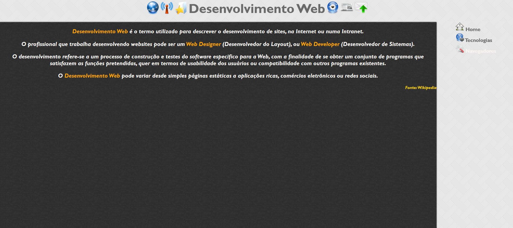
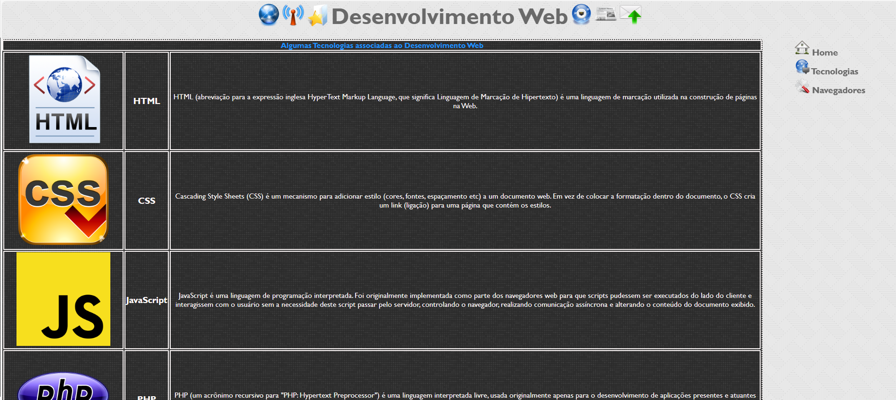
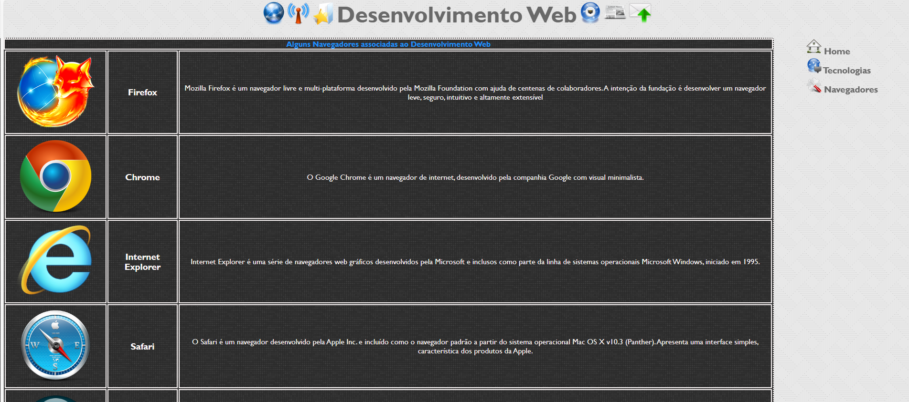

# atividadeCSS-Navegadores
mais uma atividade de CSS feita em aula para aprender CSS com um site sobre navegadores e linguagens.
  

  <h3>Página Inicial. Um css bem simples</h3>
  

  

  <h3>Página das tecnologias</h3>
  

  

  <h3>Página dos navegadores</h3>
  

